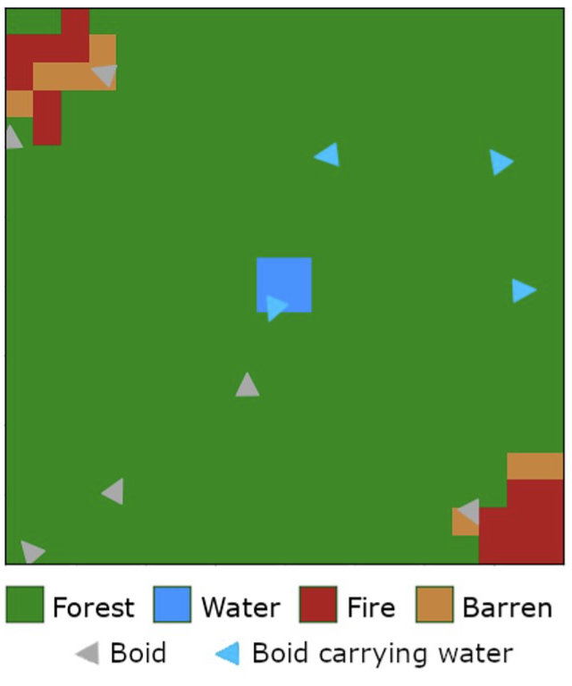
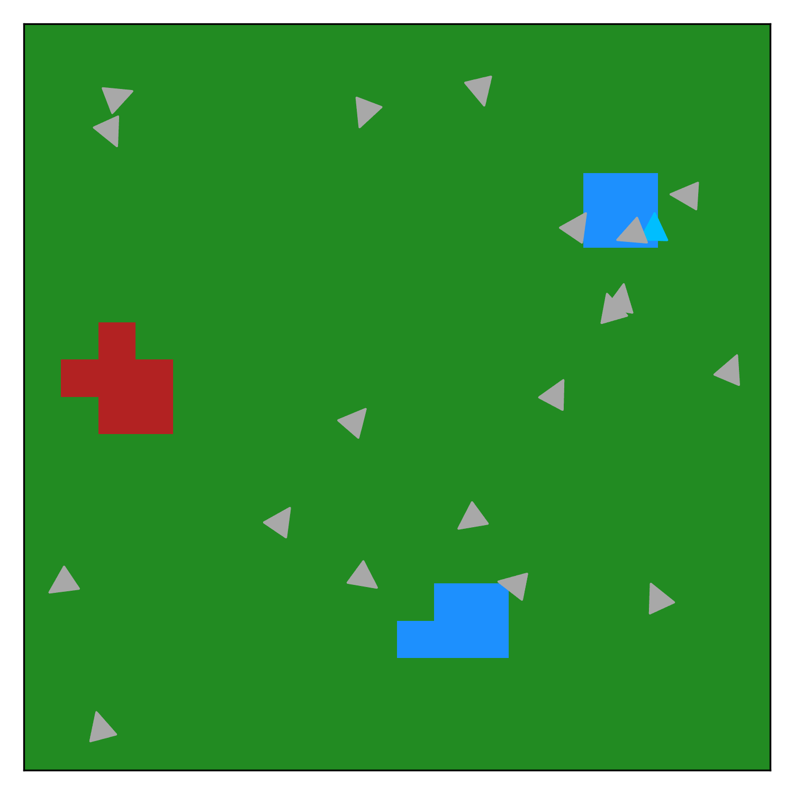

# NaCoProject

Project for the course 2223 Natural Computing (KW3 V) by group 22.

## About the project
The source code is aimed at learning swarm-based fire-extinguishing behaviour. More specifically this entails a simulated `Environment` (a cellular automaton) containing forest, water, fire and barren tiles, as shown in the figure below.  



A `Swarm` of agents that are based on Reynolds's `Boids` is superimposed on this environment (indicated with the triangular shapes in the figure above). The boids are enhanced by providing them with the capacity of collecting, carrying and dropping water. Ultimately, the swarm of Boids is tasked with extinguishing all fires that occur in the environment. 

Using a genetic algorithm, we aim to optimize the `Rule`s that define the swarm such that the task can be carried out successfully.  

## Usage
### Getting started
The `requirements.txt` file can be used to create a python environment that supports the source code, by issuing the command.

```bash
pip install -r requirements.txt
```

In any terminal supporting python (and having the pip packagemanager installed).

### Running the main program

The main program can be started by running

```bash
python main.py
```
Note however that there are a few parameters that could (or should!) be set before running the program. These parameters are specified in `main.py` and include 

- `results_file`: The filepath where to store the results of the program. 
- `show_display`: A boolean indicating whether the final (optimized) swarm should be shown. 
- `n_observations`: The number of observations (optimizing a swarm) the program should make. 
- `steps`: How long the simulation after the evolution should run
- `infinite`: A boolean indicating whether the display should be shown until it is closed manually. 
- `n_iters`: How long the simulations during the evolution should run.

Furthermore, a custom environment can be specified by changing the line 

```python
env = Environment.from_file(r'grid_files\presentation.in')
```

to the desired grid file from `grid_files/`.

Once the optimization is complete, the best-performing swarm is shown in action (that is, if `show_display` is set to `True`) as shown below:



Furthermore, the fitness of all swarms that have been created during the optimization are stored in `.csv` format as `results_file`, as demonstrated in the example:
```
Obs,Gen,Alignment,Cohesion,Separation,GoToFire,GoToWater,fitness
  0,   0, -0.2514,  0.4018, -0.4037,  0.8228,  0.9827, -42.00
  0,   0, -0.6770,  0.6549, -0.4037,  0.8869,  0.9827, -52.50
  0,   0,  0.6467, -0.6390, -0.5953,  0.8098,  0.1038, -35.50
  0,   0, -0.6185, -0.2027, -0.9580,  0.5101, -0.4257, -68.00
  0,   0,  0.2599,  0.3795,  0.5733,  0.2516,  0.2278, -76.00
  0,   0, -0.8724, -0.4085,  0.9101, -0.6852,  0.6386, -66.50
  0,   0, -0.6636, -0.2027, -0.5855, -0.1015, -0.6672, -37.50
  0,   0,  0.2446,  0.5938, -0.4037,  0.7224,  0.7732, -45.50
  0,   0, -0.7226, -0.7133,  0.9101, -0.6852, -0.6485, -58.00
  0,   0,  0.1940, -0.3423,  0.5733,  0.3508,  0.4504, -61.00
  0,   0, -0.7226, -0.4085,  0.9101, -0.8335, -0.4784, -39.00
  0,   0, -0.9506,  0.1001,  0.7886, -0.8893,  0.5816, -48.50
  0,   0,  0.7093, -0.2705, -0.7466, -0.1168,  0.9827, -42.50
  0,   0,  0.2051, -0.0156, -0.6206,  0.9851, -0.1884, -53.50
  0,   0, -0.6770, -0.8195, -0.5972,  0.8228,  0.9827, -36.00
  0,   0,  0.1282,  0.2499, -0.4678,  0.8408, -0.9304, -52.00
```
### Analysing the results
The figures that have been presented have been created using the file `analysis.py`, where the results of the optimized swarms can be analysed by changing the variables 

```python    
environments = ["volcano", "lake", "random", "river",]
results_directory = r"./results"
``` 

to the right path.


## References
Craig W. Reynolds. 1987. Flocks, herds and schools: A distributed behavioral model. SIGGRAPH Comput. Graph. 21, 4 (July 1987), 25–34. https://doi.org/10.1145/37402.37406
